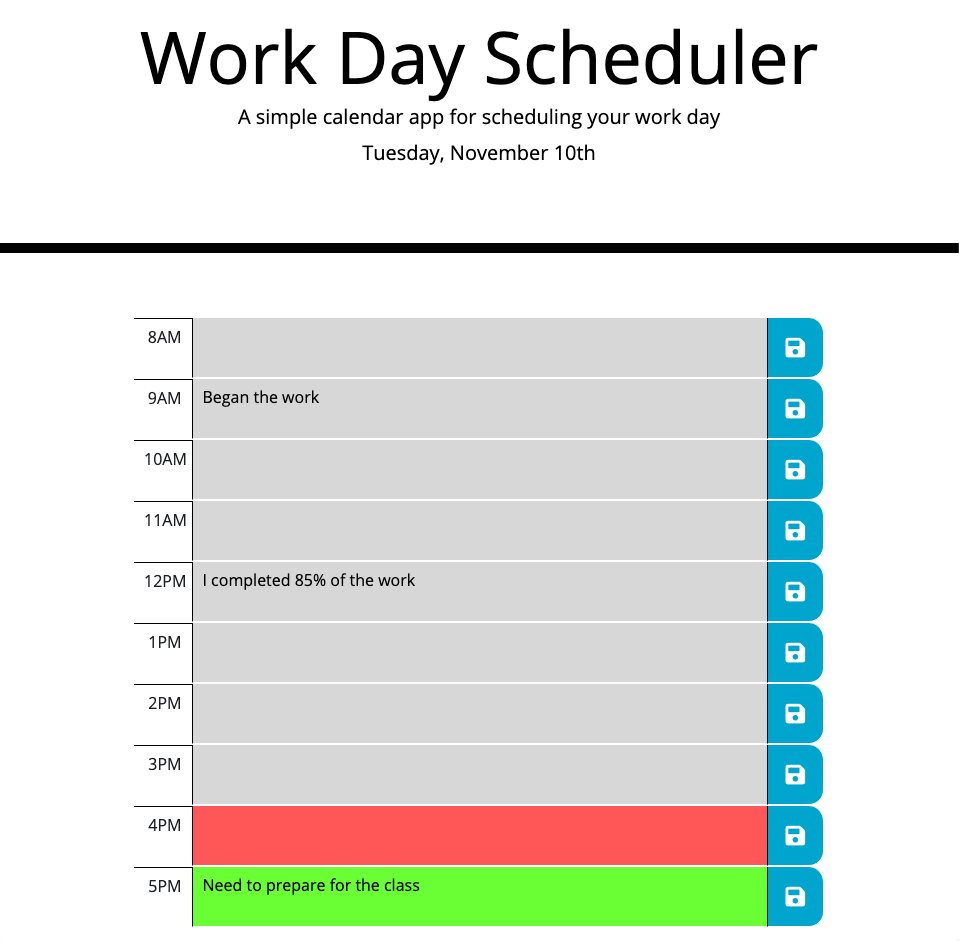

# today-planner

## Description

This site can be used as a planner for someones working day. In the header of the page is included the title and today's day information, and bellow of header is the calendar which includes multiple rows from 8am to 5pm corresponding.

Each text area can have three colors. First color is green, which shows the time until the end of the day, the second color is gray, which shows the time passed from a working day, and the last color is red which shows current time. Next, if the current time is not included in the calendar interval; then, the color of all text area rows will be gray.

Moreover, on the right side of each row is a save button, which should be used in the case user wants to keep saved the info from text area in the local storage of the browser, and to find it all the time when he or she will enter to check the planner.

## Deployed link of the site

[Deployed link: https://paveldarii.github.io/today-planner/](https://paveldarii.github.io/today-planner/)

## Copyright

Pavel Darii 2020
